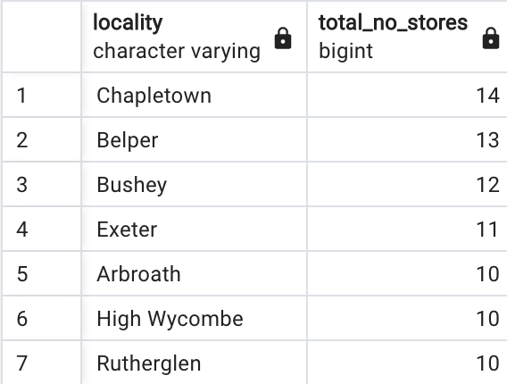

# Here I will be listing all of the queries that I ran on my database

### 1. How many stores does the business have and in which countries?

### Query:
```sql
SELECT 
	country_code,
	COUNT(country_code) as total_no_store
FROM dim_store_details
GROUP BY country_code;
```

### Output:


---

### 2. Which locations currenlty have the most stores?

### Query:
```sql
SELECT 
	locality,
	COUNT(locality) as total_no_stores
FROM dim_store_details
GROUP BY locality
ORDER BY total_no_stores DESC
LIMIT 7;
```

### Output:


---

### 3. Which months produce the average highest cost of sales typically?

### Query:
```sql
SELECT ROUND(CAST(sum(product_price * product_quantity) AS numeric), 2) AS total_sales, month
FROM orders_table
JOIN dim_products ON dim_products.product_code = orders_table.product_code
JOIN dim_date_times ON dim_date_times.date_uuid = orders_table.date_uuid
GROUP BY month
ORDER BY total_sales DESC
LIMIT 6;
```

### Output:


---

### 4. How many sales are coming from online?

### Query:
```sql 
SELECT  
		COUNT (*) AS number_of_sales,
		SUM(product_quantity) AS product_quantity_count,
		CASE WHEN store_type = 'Web Portal' THEN 'Web' 
			 ELSE 'Offline'
		END AS location
FROM orders_table
JOIN dim_store_details ON orders_table.store_code = dim_store_details.store_code
GROUP  BY location
```

### Output:


---

### 5. What percentage of sales come through each type of store?

### Query:
```sql
SELECT round(CAST(total_sales AS numeric) ,2),
	store_type,
	Round(CAST(total_sales/ SUM(total_sales) OVER () * 100 AS numeric),2) AS "percentage_total(%)"
FROM (SELECT  
	SUM(product_price * product_quantity) AS total_sales,
	dim_store_details.store_type AS store_type
FROM orders_table
JOIN dim_products ON orders_table.product_code = dim_products.product_code
JOIN dim_store_details ON orders_table.store_code = dim_store_details.store_code
GROUP BY store_type) AS subquery
```

### Output:


---

### 6. Which month in each year produced the highest cost of sales?

### Query:
```sql
    total_sales,
    year,
    month
FROM (
    SELECT
        ROUND(CAST(SUM(product_price * product_quantity) AS numeric), 2) AS total_sales,
        dim_date_times.year AS year,
        dim_date_times.month AS month,
        RANK() OVER (PARTITION BY dim_date_times.year ORDER BY SUM(product_price * product_quantity) DESC) AS sales_rank
    FROM
        orders_table
    JOIN
        dim_products ON orders_table.product_code = dim_products.product_code
    JOIN
        dim_date_times ON orders_table.date_uuid = dim_date_times.date_uuid
    GROUP BY
        year,
        month
) subquery
WHERE
    sales_rank = 1
LIMIT 10;
```

### Output:


---

### 7. What is our staff headcount?

### Query:
```sql
SELECT 
	SUM(staff_numbers) AS total_staff_number,
	country_code
FROM dim_store_details
GROUP BY country_code
```

### Output:


---

### 8. Which German store type is selling the most?

### Query:
```sql
SELECT 
	ROUND(CAST(SUM(product_quantity * product_price) AS NUMERIC),2) AS total_sales,
	store_type,
	country_code
FROM orders_table
JOIN dim_store_details ON orders_table.store_code = dim_store_details.store_code
JOIN dim_products ON orders_table.product_code = dim_products.product_code
WHERE country_code = 'DE'
GROUP BY store_type, country_code
```

### Output:


---

### 9. How quickly is the company making sales?

### Query:
```sql
WITH join_date_time AS (SELECT  year, cast(CONCAT(year ,'-', month ,'-', day ,' ', timestamp) AS timestamp) AS time_date
FROM dim_date_times),
next_highest_time_date AS(
SELECT year,time_date,
LEAD (time_date,1) OVER (ORDER BY time_date) AS next_time_date
FROM join_date_time),
avg_difference_date_time as (
	SELECT year, AVG(next_time_date - time_date) AS average_time_difference
	FROM next_highest_time_date
	GROUP BY year
)
SELECT year, 
		CONCAT('"hours": ',extract(hour from average_time_difference), 
		', "minutes": ',extract(minute from average_time_difference), 
		', "seconds": ',round(extract(second from average_time_difference)),
		', "milliesconds": ',round(extract(millisecond from average_time_difference))) as actual_time_taken
FROM avg_difference_date_time
ORDER BY average_time_difference desc
LIMIT 5;
```


### Output:


---

By Thilakshan Balasubramaniam